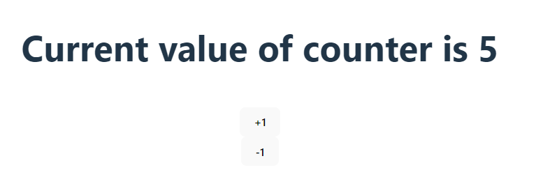

# Hooks in react

- **[What is hook in react](#what-is-a-hook-in-react)**
- **[Why hooks are needed](#why-hooks-are-needed)**
- **[useState() hook](#usestate-hook)**
- **[Simple Example of useState() hook](#Simple-Example-of-useState-hook)**


## What is a Hook in React?

In ```React, a Hook is a feature``` introduced in version 16.8 ```that allows functional components to use state, lifecycle methods, and other React features that were previously exclusive to class components.``` Hooks are functions that enable developers to "hook into" React state and lifecycle features from functional components.

## Why Hooks are Needed?

1. **Functional Components Enhancement:** Before hooks, functional components lacked state and lifecycle capabilities, which were available only in class components. Hooks bridge this gap, empowering functional components with state management and more.


      - **Lifecycle Methods in React** are predefined functions within component classes.
      
      - They're automatically invoked at specific stages of a component's existence: creation, update, and removal.
      
      - Developers use these methods to perform tasks like initializing state, fetching data, managing updates, or cleaning up resources.

      - They offer control and flexibility, allowing developers to orchestrate behavior at crucial points during the component's life.

      - Same work in functional components is done using hooks now.

    `Read more about this in useEffect() hook.`

2. **Code Reusability:** Hooks promote code reuse by allowing developers to extract and share stateful logic between components without using higher-order components or render props.

3. **Simplified Code:** They simplify component logic, making it more readable and maintainable by removing the need for complex class syntax and providing a more linear and concise structure.

### `useState()` Hook

1. **Purpose:** `useState()` is a built-in hook that allows functional components to add state variables to manage and update state within the component.

2. **Usage:** It returns a stateful value and a function to update that value. The initial state can be passed as an argument to `useState`.

3. **Example:**

### Counter using useState() Hook
```javascript
import { useState } from 'react'
import './App.css'

function App() {
  //   useState hook with counter varible and 
  //   setCount method to set value of counter
  const [counter, setCount] = useState(0)

  // increment value of counter by 1 if counter < 20 
  const addValue = () => {
    if (counter <= 19) {
      setCount(counter + 1)
    } else {
      alert("counter max value is 20");
    }
  }
  // decrement value of counter by 1 if counter > 0 only
  const removeValue = () => {
    if (counter > 0) {
      setCount(counter - 1)
    } else {
      alert("counter value can not be negative");
    }
  }


  return (
    <>
      <h1>Current value of counter is {counter}</h1>
      <br />
      {/* button with onClick event for increment */}   
      <button onClick={addValue}>+1</button>
      <br />
      {/* button with onClick event for decrement */}   
      <button onClick={removeValue}> -1</button>
    </>
  )
}

export default App;

```

### Simple Example of useState() Hook
In this example, useState() initializes a state variable `counter` with an initial value of 0. Clicking the `+1` and `-1` button updates the `counter` by calling `setCounter`, which triggers a re-render and updates the displayed count value.

Hooks like useState() enable functional components to manage state effortlessly, making them more powerful and versatile in React development.

