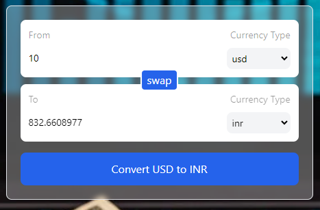

# How to write custom hooks in react 
## ` Currency Project`
------


------

### Source Code - [Link](https://github.com/NayanSayaji/react-projects/tree/main/currency-converter)

- [Folder Structure](#folder-structure)
- [main.jsx](#mainjsx)
- [components/InputBox.jsx](#componentsinputboxjsx)
   - Code Explanation (within components/InputBox.jsx)
   - Explanation (within components/InputBox.jsx)
- [components/index.js](#componentsindexjs)
    - Code Explanation (within components/index.js)
- [hooks/useCurrencyInfo.js - Custom Hook](#hooksusecurrencyinfojs)
    - Code Explanation (within hooks/useCurrencyInfo.js)
    - Explanation (within hooks/useCurrencyInfo.js)
- [App.jsx](#appjsx)
    - Explanation (within App.jsx)
- [Demo Image of Application ](#demo-image-of-application)
    - InputBox Component


-------

### Folder Structure
```bash
currency-converter
├── node_modules
├── public
│   └── vite.svg
├── src
│   ├── App.jsx
│   ├── assets
│   │   └── react.svg
│   ├── components
│   │   ├── InputBox.jsx
│   │   └── index.js
│   ├── hooks
│   │   └── useCurrencyInfo.js
│   ├── index.css
│   ├── main.jsx
├── tailwind.config.js
├── vite.config.js
├── .eslintrc.cjs
├── .gitignore
├── README.md
├── index.html
├── package-lock.json
├── package.json
├── postcss.config.js
```

## # main.jsx
```javascript
import React from 'react'
import ReactDOM from 'react-dom/client'
import App from './App.jsx'
import './index.css'

ReactDOM.createRoot(document.getElementById('root')).render(
  <React.StrictMode>
    <App />
  </React.StrictMode>,
)
```

## # components/InputBox.jsx
The `InputBox` component is designed to provide an input field for an amount and a dropdown to select a currency type. It utilizes features from React, specifically the `useId` hook from the `react` package.

### Code Explanation

```javascript
import { useId } from "react";

function InputBox({
    label,
    amount,
    onAmountChange,
    onCurrencyChange,
    currencyOptions = [],
    selectCurrency = "usd",
    amountDisable = false,
    currencyDisable = false,
    className = ""
}) {
    // Generates a unique ID for the input field
    const amountInputId = useId();

    return (
        <div className={`bg-white p-3 rounded-lg text-sm flex ${className}`}>
            {/* Left side containing the label and amount input */}
            <div className="w-1/2">
                <label htmlFor={amountInputId} className="text-black/40 mb-2 inline-block">
                    {label}
                </label>
                <input
                    id={amountInputId}
                    className="outline-none w-full bg-transparent py-1.5"
                    type="number"
                    placeholder="Amount"
                    disabled={amountDisable}
                    value={amount}
                    onChange={(e) => onAmountChange && onAmountChange(Number(e.target.value))}
                />
            </div>

            {/* Right side containing the currency selection */}
            <div className="w-1/2 flex flex-wrap justify-end text-right">
                <p className="text-black/40 mb-2 w-full">Currency Type</p>
                <select
                    className="rounded-lg px-1 py-1 bg-gray-100 cursor-pointer outline-none"
                    value={selectCurrency}
                    onChange={(e) => onCurrencyChange && onCurrencyChange(e.target.value)}
                    disabled={currencyDisable}
                >
                    {/* Maps through currencyOptions to generate select options */}
                    {currencyOptions.map((currency) => (
                        <option key={currency} value={currency}>
                            {currency}
                        </option>
                    ))}
                </select>
            </div>
        </div>
    );
}

export default InputBox;
```

### Explanation

- **Props**:
  - `label`: Descriptive label for the input field.
  - `amount`: Current value of the amount.
  - `onAmountChange`: Function triggered on amount input change.
  - `onCurrencyChange`: Function triggered on currency selection change.
  - `currencyOptions`: Array containing available currency options.
  - `selectCurrency`: Default selected currency.
  - `amountDisable`: Disables amount input if `true`.
  - `currencyDisable`: Disables currency selection if `true`.
  - `className`: Additional CSS class for styling.

- **Functionality**:
  - Generates a unique ID (`amountInputId`) for the amount input field.
  - Renders an input field for the amount and a dropdown for currency selection.
  - Allows customization and disables fields based on provided props.
  - Calls corresponding functions (`onAmountChange`, `onCurrencyChange`) on user interaction.

This `InputBox` component can be easily integrated into other parts of the application to handle currency-related inputs.

---------
---------

## # components/index.js - Custom hook 

The `index.js` file within the `components` directory serves as an entry point for exporting components. This specific code snippet demonstrates the export of the `InputBox` component.

### Code Explanation

```javascript
import InputBox from "./InputBox";

export { InputBox };
```

---------
---------

## # hooks/useCurrencyInfo.js

The `useCurrencyInfo` hook is designed to fetch real-time currency data from an external API based on the provided currency code. This hook utilizes functionalities from React's `useEffect` and `useState` hooks to manage data fetching and state.

### Code Explanation

```javascript
import { useEffect, useState } from "react";

function useCurrencyInfo(currency) {
  // API URL for retrieving real-time currency values
  let url = `https://cdn.jsdelivr.net/gh/fawazahmed0/currency-api@1/latest/currencies/${currency}.json`;

  // State to store fetched data
  const [data, setData] = useState({});

  useEffect(() => {
    // Fetching data from the provided API URL
    fetch(url)
      .then((res) => res.json())
      .then((res) => {
        // Updating state with the fetched currency data for the specified currency code
        setData(res[currency]);
      });
    console.log(data); // Note: This console.log may not display updated data due to closure.
  }, [currency]);

  console.log(data); // Note: This console.log may not display updated data due to closure.
  return data;
}

export default useCurrencyInfo;
```

### Explanation

- **Dependencies**:
  - `useEffect` and `useState` are imported from the React package to manage side effects and state within this custom hook.

- **Functionality**:
  - `useCurrencyInfo` takes a `currency` parameter representing the currency code (e.g., USD, EUR).
  - Constructs a URL specific to the provided currency code to fetch real-time currency data.
  - Utilizes `useState` to initialize and manage the `data` state, which holds the fetched currency information.
  - Uses `useEffect` to trigger the data fetching process when the `currency` value changes.
  - Upon data retrieval, updates the `data` state with the fetched currency information.
  - Logs the fetched `data`, although due to closure, these logs may not display the updated data immediately.
  - Returns the fetched `data`.

This `useCurrencyInfo` hook can be employed within React components to fetch and manage real-time currency data for a specified currency code. It's useful for applications requiring currency-related information, such as converters or financial tools.

---------
---------

## # App.jsx

The `App.jsx` file contains the main component that orchestrates the currency conversion functionality within the Currency Converter application.

### Code Explanation

```javascript
import { useState } from "react";
import { InputBox } from "./components";
import useCurrencyInfo from "./hooks/useCurrencyInfo";

function App() {
  // State variables to manage input, conversion, and currency selection
  const [amount, setAmount] = useState(0);
  const [from, setFrom] = useState("usd");
  const [to, setTo] = useState("inr");
  const [convertedAmount, setConvertedAmount] = useState(0);

  // Fetches real-time currency data based on 'from' currency
  const currencyInfo = useCurrencyInfo(from);

  // Retrieves available currency options
  const options = Object.keys(currencyInfo);

  // Swaps 'from' and 'to' currencies along with their amounts
  const swap = () => {
    setFrom(to);
    setTo(from);
    setConvertedAmount(amount);
    setAmount(convertedAmount);
  };

  // Converts amount based on 'from' and 'to' currencies
  const convert = () => {
    setConvertedAmount(amount * currencyInfo[to]);
  };

  return (
    // Main layout containing input fields, conversion functionality, and styling
    <div
      className="w-full h-screen flex flex-wrap flex-col md:flex-row justify-center items-center bg-cover bg-no-repeat"
      style={{
        backgroundImage: `url('https://images.pexels.com/photos/5980800/pexels-photo-5980800.jpeg?auto=compress&cs=tinysrgb&w=1260&h=750&dpr=1')`,
      }}
    >
      {/* Left section containing decorative background */}
      <div className="bg-black flex flex-wrap h-screen bg-cover bg-no-repeat w-1/2 justify-center top-1/2" style={{
        backgroundImage: `url('https://images.pexels.com/photos/186461/pexels-photo-186461.jpeg?auto=compress&cs=tinysrgb&w=600')`,        
      }}>
          <h1 className="text-white bg-gradient-to-t pt-48 pl-5 text-7xl backdrop-blur-md opacity-100">Currency Converter with the RealTime currency values.</h1>
      </div>

      {/* Right section containing the currency conversion form */}
      <div className="w-1/2">
        <div className="w-full max-w-md mx-auto border border-gray-60 rounded-lg p-5 backdrop-blur-sm bg-white/30">
          <form
            onSubmit={(e) => {
              e.preventDefault();
              convert();
            }}
          >
            {/* Input box for 'from' currency */}
            <div className="w-full mb-1">
              <InputBox
                label="From"
                amount={amount}
                currencyOptions={options}
                onCurrencyChange={(currency) => setFrom(currency)}
                selectCurrency={from}
                onAmountChange={(amount) => setAmount(amount)}
              />
            </div>

            {/* Swap button */}
            <div className="relative w-full h-0.5">
              <button
                type="button"
                className="absolute left-1/2 -translate-x-1/2 -translate-y-1/2 border-2 border-white rounded-md bg-blue-600 text-white px-2 py-0.5"
                onClick={swap}
              >
                swap
              </button>
            </div>

            {/* Input box for 'to' currency (disabled for amount input) */}
            <div className="w-full mt-1 mb-4">
              <InputBox
                label="To"
                amount={convertedAmount}
                currencyOptions={options}
                onCurrencyChange={(currency) => setTo(currency)}
                selectCurrency={to}
                amountDisable
              />
            </div>

            {/* Submit button for conversion */}
            <button type="submit" className="w-full bg-blue-600 text-white px-4 py-3 rounded-lg">
              Convert {from.toUpperCase()} to {to.toUpperCase()}
            </button>
          </form>
        </div>
      </div>
    </div>
  );
}

export default App;
```

### Explanation

- **Functionality**:
  - Manages state for amount, 'from' and 'to' currencies, and converted amount.
  - Uses the `useCurrencyInfo` hook to fetch real-time currency data for the selected 'from' currency.
  - Provides input fields for 'from' and 'to' currencies with options and handles their changes.
  - Includes a swap button to interchange 'from' and 'to' currencies along with their amounts.
  - Allows users to convert currency based on the provided amount and selected currencies.

This `App.jsx` component serves as the central logic and user interface for the Currency Converter application, facilitating real-time currency conversion.


### Demo Image of Application


#### InputBox Component
