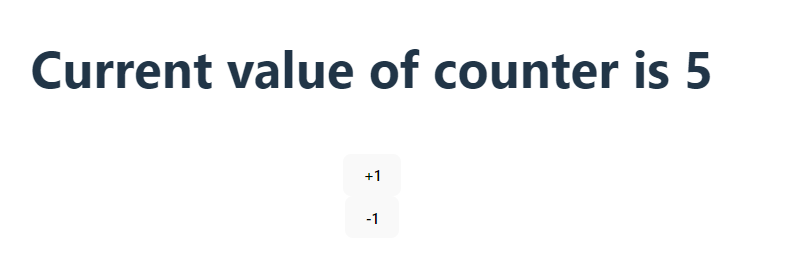

# Hooks in react

1. [What is hook in react](#what-is-hook-in-react)
2. [Why hooks are needed](#why-hooks-are-needed)
3. [useState() hook](#useState-hook)
4. [Simple Example of useState() hook](#Simple-Example-of-useState-hook)

## What is Hook in react : 


### Counter using useState() Hook
```javascript
import { useState } from 'react'
import './App.css'

function App() {
  //   useState hook with counter varible and 
  //   setCount method to set value of counter
  const [counter, setCount] = useState(0)

  // increment value of counter by 1 if counter < 20 
  const addValue = () => {
    if (counter <= 19) {
      setCount(counter + 1)
    } else {
      alert("counter max value is 20");
    }
  }
  // decrement value of counter by 1 if counter > 0 only
  const removeValue = () => {
    if (counter > 0) {
      setCount(counter - 1)
    } else {
      alert("counter value can not be negative");
    }
  }


  return (
    <>
      <h1>Current value of counter is {counter}</h1>
      <br />
      {/* button with onClick event for increment */}   
      <button onClick={addValue}>+1</button>
      <br />
      {/* button with onClick event for decrement */}   
      <button onClick={removeValue}> -1</button>
    </>
  )
}

export default App;

```
